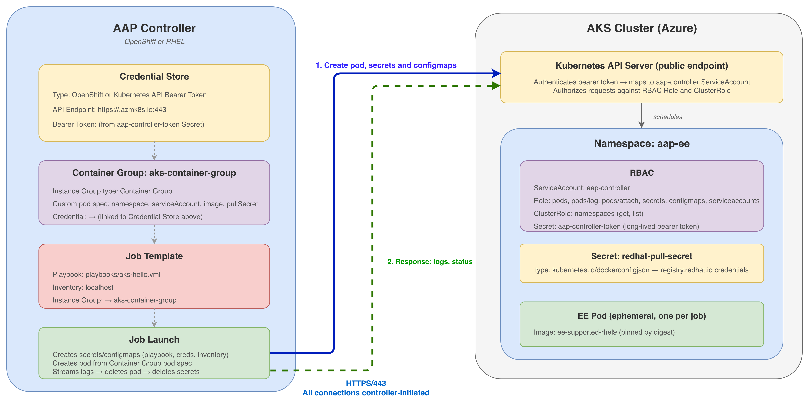

# Integrating AAP Container Groups with AKS

## What Container Groups do

**Container Groups** allow an AAP controller to execute Ansible jobs as ephemeral pods on a remote Kubernetes cluster. The controller authenticates to the cluster's API server via a bearer token, creates a pod per job using a defined pod spec, and retrieves output through the Kubernetes `pods/log` and `pods/attach` APIs. The pod runs `ansible-runner worker`, executes the playbook, and is deleted on completion. No persistent infrastructure runs on the target cluster between jobs.

This guide implements Container Groups on **AKS** with the AAP controller running **outside** AKS — on OpenShift, RHEL, or any supported platform. The only network requirement is outbound HTTPS from the controller to the AKS API server.



## Requirements

### Network

The AAP controller must have **outbound HTTPS (TCP/443) access** to the AKS API server endpoint. This is the only network path required. No VPN, VNet peering, or inbound exposure on the AKS side is needed beyond the default Kubernetes API.

All connections are **initiated by the controller to the AKS API server**. The controller creates pods, watches their status, reads their logs, and deletes them — all through standard Kubernetes API calls over HTTPS. Log retrieval works the same way: the controller calls the Kubernetes `pods/log` and `pods/attach` endpoints on the AKS API server, which returns the stdout captured by the kubelet on the node. The EE pod itself never opens a connection back to the controller — it writes to its own stdout, and the controller fetches it through the API.

If your AKS cluster uses a **private API endpoint**, you will need network-level connectivity (VPN, peering, or ExpressRoute) between the controller's network and the AKS VNet.

### Credentials

Two sets of credentials are required:

1. **Kubernetes service account bearer token** — for the AAP controller to authenticate to the AKS API server. You create this on the AKS side (step 2) and store it in AAP as a credential.
2. **Red Hat registry service account** — for AKS nodes to pull execution environment images from `registry.redhat.io`. Create one at [access.redhat.com/terms-based-registry](https://access.redhat.com/terms-based-registry). Use a registry service account (not your personal RHN login) — service account tokens are scoped to registry pulls only and can be revoked and regenerated independently.


## Step 1 — Provision the AKS cluster

If you already have an AKS cluster with `kubectl` access, skip to step 2.

```bash
az group create --name <resource-group> --location eastus
az aks create \
  --resource-group <resource-group> \
  --name aap-aks \
  --node-count 1 \
  --node-vm-size Standard_D2s_v5 \
  --generate-ssh-keys
az aks get-credentials --resource-group <resource-group> --name aap-aks
```

Verify the node is ready:

```bash
kubectl get nodes
```

## Step 2 — Create the namespace and RBAC objects

The AAP controller authenticates to AKS as a Kubernetes service account and operates within a dedicated namespace. This step creates the identity, permissions, and authentication token the controller will use.

### Create the namespace

```bash
kubectl create namespace aap-ee
```

This namespace is where all EE pods will be scheduled. The controller's service account is scoped to this namespace only (with one cluster-level exception explained below).

### Apply the RBAC manifests

```bash
kubectl apply -f examples/aks/container-group/rbac.yaml
```

This manifest creates the following objects:

**ServiceAccount `aap-controller`** — the Kubernetes identity the AAP controller assumes when it makes API calls to AKS. All pod lifecycle operations are performed as this identity.

**Role `aap-controller`** (namespace-scoped to `aap-ee`) — the minimum permissions the controller needs to manage job pods:

| Resource | Verbs | Purpose |
|----------|-------|---------|
| `pods` | create, delete, get, list, watch, patch | Create EE pods per job, monitor status, clean up on completion |
| `pods/log` | get, list | Stream stdout/stderr from the running pod back to the AAP job output |
| `pods/attach` | create | Attach to the pod's TTY for real-time `ansible-runner` communication |
| `secrets` | create, delete, get, list, patch | Inject playbook content and credentials into the pod |
| `configmaps` | create, delete, get, list, patch | Pass configuration data (inventory, extra vars) into the pod |
| `serviceaccounts` | get, list | Validate the service account referenced in the pod spec exists |

**RoleBinding `aap-controller`** — binds the Role to the ServiceAccount, granting the above permissions within `aap-ee` only.

**ClusterRole + ClusterRoleBinding `aap-controller-cluster`** — grants `get` and `list` on namespaces cluster-wide. AAP requires this to verify the target namespace exists before scheduling pods. This is the only permission that extends beyond `aap-ee`.

### Bearer token Secret

The manifest also creates a **Secret** of type `kubernetes.io/service-account-token`. Kubernetes generates a long-lived bearer token bound to the `aap-controller` service account and stores it in this Secret. This is the credential the AAP controller uses to authenticate — no kubeconfig file is needed, just the token and the API server URL.

Starting with Kubernetes 1.24, auto-mounted service account tokens are short-lived (1-hour TTL by default). AAP needs a persistent credential it can store and reuse across job launches. Creating an explicit Secret of type `kubernetes.io/service-account-token` produces a non-expiring token that remains valid until the Secret is deleted.

## Step 3 — Create the Red Hat pull secret

AKS nodes do not have Red Hat registry credentials. When the controller schedules an EE pod, the pod spec references an image from `registry.redhat.io`. The kubelet must authenticate to the registry to pull this image.

Create a `dockerconfigjson` secret in the `aap-ee` namespace:

```bash
kubectl create secret docker-registry redhat-pull-secret \
  --namespace aap-ee \
  --docker-server=registry.redhat.io \
  --docker-username='<service-account-username>' \
  --docker-password='<service-account-token>'
```

- `<service-account-username>` — the Red Hat registry service account name, format `<orgid>|<name>` (e.g., `11009103|aks-aap`). Created at [access.redhat.com/terms-based-registry](https://access.redhat.com/terms-based-registry).
- `<service-account-token>` — the JWT token generated for that service account. Only shown at creation time or when you explicitly regenerate it.

The pod spec in step 5 references this secret by name in its `imagePullSecrets` field. The name must match exactly.

## Step 4 — Extract the credentials for AAP

AAP needs two values to connect to AKS: the **API server URL** and the **bearer token**.

### Bearer token

```bash
kubectl get secret aap-controller-token -n aap-ee \
  -o jsonpath='{.data.token}' | base64 -d
```

This outputs the raw JWT bound to the `aap-controller` service account.

### API server URL

```bash
kubectl config view --minify -o jsonpath='{.clusters[0].cluster.server}'
```

This returns the AKS API endpoint (e.g., `https://aap-aks-xxxx.hcp.eastus.azmk8s.io:443`).

Save both values securely. Do not commit them to version control.

### Verify connectivity

Before configuring AAP, confirm the controller can reach the AKS API. From the controller node (or a machine with equivalent network access):

```bash
curl -sk https://<aks-api-server-url>/healthz
# expect: ok
```

If this times out, resolve the network path before proceeding.

## Step 5 — Configure AAP

All remaining configuration happens in the AAP web UI. You are creating a chain of objects:

**Credential** (how to authenticate to AKS) → **Container Group** (where to run pods, with what pod spec) → **Project** (what playbooks to use) → **Inventory** (what hosts to target) → **Job Template** (ties everything together)

### 5.1 — Create the Kubernetes credential

Navigate to **Administration > Credentials > Add**.

| Field | Value |
|-------|-------|
| **Credential type** | OpenShift or Kubernetes API Bearer Token |
| **OpenShift or Kubernetes API Endpoint** | The AKS API URL from step 4 |
| **API authentication bearer token** | The bearer token from step 4 |
| **Verify SSL** | Unchecked for lab use. In production, upload the AKS cluster's CA certificate and leave SSL verification enabled |

Save the credential.

The credential type is called "OpenShift or Kubernetes API Bearer Token" regardless of the target platform. The underlying mechanism is a bearer token against any Kubernetes-compatible API server — AKS, EKS, GKE, or vanilla Kubernetes.

### 5.2 — Create the Container Group

Navigate to **Administration > Instance Groups > Add > Add Container Group**.

| Field | Value |
|-------|-------|
| **Name** | `aks-container-group` |
| **Credential** | The credential created in 5.1 |
| **Customize pod spec** | Enabled |

Paste the following pod spec. This is the template the controller uses every time it creates an EE pod in AKS:

```yaml
apiVersion: v1
kind: Pod
metadata:
  namespace: aap-ee
  labels:
    ansible_job: ''
spec:
  serviceAccountName: aap-controller
  imagePullSecrets:
    - name: redhat-pull-secret
  automountServiceAccountToken: false
  containers:
    - image: >-
        registry.redhat.io/ansible-automation-platform-26/ee-supported-rhel9@sha256:fe0982d489065a2a287fe076873cf1faa5410c0879def91bbc756280e924118d
      name: worker
      args:
        - ansible-runner
        - worker
        - '--private-data-dir=/runner'
      resources:
        requests:
          cpu: 250m
          memory: 100Mi
```

What each field does:

- **`namespace: aap-ee`** — targets the namespace where the RBAC and pull secret are configured. Without this, the controller may create pods in a default namespace where it has no permissions.
- **`serviceAccountName: aap-controller`** — runs the pod under the service account from step 2, which has the RBAC bindings required for AAP's pod management operations.
- **`imagePullSecrets`** — references the Red Hat pull secret from step 3 so the kubelet can authenticate to `registry.redhat.io`. The name must match the secret exactly.
- **`automountServiceAccountToken: false`** — the EE pod does not need to make Kubernetes API calls. Disabling the token mount prevents an unnecessary credential from being available inside the pod.
- **`image`** — the execution environment image, pinned by digest (`@sha256:...`). Digest pinning ensures the same binary image runs every time, regardless of tag mutations upstream.
- **`args`** — `ansible-runner worker --private-data-dir=/runner`. The controller injects the playbook content, inventory, and credentials into the pod at runtime via mounted secrets and configmaps. `ansible-runner` reads them from `/runner` and executes.
- **`resources.requests`** — the scheduling floor. The Kubernetes scheduler places the pod on a node with at least this much available capacity. Increase these values for playbooks with heavier resource needs.

A version with **pod anti-affinity** (to spread concurrent jobs across nodes in multi-node clusters) is available at `examples/aks/container-group/pod-spec.yaml`.

### 5.3 — Create a project

Navigate to **Resources > Projects > Add**.

| Field | Value |
|-------|-------|
| **Source Control Type** | Git |
| **Source Control URL** | A Git repository containing your playbooks |

Save and wait for the sync to complete (status: "Successful"). The project sync pulls playbook source into the controller, which then injects it into EE pods at launch time. The playbooks do not need to exist on AKS or inside the EE image.

### 5.4 — Create an inventory

Navigate to **Resources > Inventories > Add**.

Create an inventory named `localhost`, then go to **Hosts > Add** and add a host named `localhost`. For the smoke test, the playbook targets `localhost` with `connection: local` — it runs entirely inside the EE pod.

For production workloads, use inventories with the actual target hosts or dynamic inventory sources.

### 5.5 — Create a job template

Navigate to **Resources > Templates > Add > Add Job Template**.

| Field | Value |
|-------|-------|
| **Playbook** | `playbooks/aks-hello.yml` |
| **Inventory** | `localhost` |
| **Instance Group** | `aks-container-group` |

The **Instance Group** assignment is what routes execution to AKS. When this template launches, the controller does not run the playbook locally — it creates a pod in AKS via the Container Group's credential and pod spec.

## Step 6 — Launch and verify

Launch the job template from the AAP UI. In a separate terminal, watch AKS:

```bash
kubectl get pods -n aap-ee -w
```

The pod lifecycle:

1. **`Pending`** — the controller submitted the pod spec. The scheduler is finding a node.
2. **`ContainerCreating`** — node assigned. The kubelet is pulling the EE image (first run is slower; subsequent runs on the same node use the cached image).
3. **`Running`** — `ansible-runner worker` is executing the playbook.
4. **Pod deleted** — job completed. The controller cleaned up the pod.

In the AAP job output, the playbook reports the hostname, OS, and IP of the pod. The hostname is the Kubernetes pod name (e.g., `automation-job-42-abcde`), the OS is RHEL9 (from the EE image), and the IP is from the AKS pod CIDR. None of these match the controller — confirming the job executed in AKS.

## How it works end to end

1. A job template assigned to `aks-container-group` is launched.
2. The controller reads the Container Group's credential (bearer token + API URL) and pod spec.
3. The controller sends a `POST /api/v1/namespaces/aap-ee/pods` to the AKS API server, authenticated with the bearer token. The pod spec includes the playbook content, inventory, and credentials as mounted secrets and configmaps.
4. AKS schedules the pod. The kubelet pulls the EE image using the `redhat-pull-secret`.
5. `ansible-runner worker` reads the injected content from `/runner` and runs the playbook.
6. stdout and status stream back to the controller via the Kubernetes API (`pods/log`, `pods/attach`).
7. The controller deletes the pod on completion. No state persists in AKS between jobs.

The entire integration is HTTPS calls from the controller to the AKS API server. No VPN, no peering, no inbound ports on AKS. The controller initiates every connection — the EE pod never connects back to the controller or any external endpoint. It writes to stdout, and the controller retrieves that output through the Kubernetes API.
